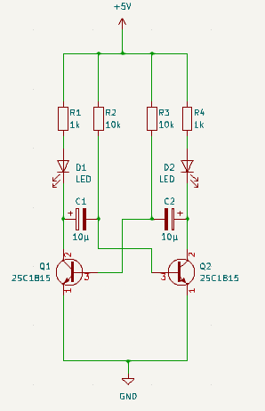
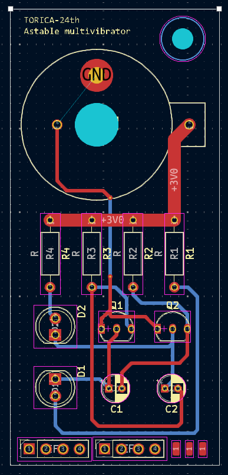

# 電装新歓2025
電装班に興味を持ってくれてありがとう！

えっ？もう作業体験を終えたのかい？じゃあもう君は立派な電装班員だ！

## 電装班とは
鳥人間コンテストの滑空機に搭載する以下のような装置を開発しています．
- 高度測定装置
- 機速測定装置
- 測定データ収集・保存装置
- 操縦装置

## 作業体験
### [AtCorder](https://atcoder.jp/contests/apg4b)
電装班ではArduinoIDEを用いてプログラムの作成をします．
その際，C言語（正確にはC++も含む）と呼ばれるプログラミング言語を使用します．
今後使えるようになるために，[AtCorder](https://atcoder.jp/contests/apg4b)という競技プログラミングサイトで練習をしましょう！

### [鳥科電装勉強](https://geode-kicker-e37.notion.site/f4303f1da5d94d21af8da94cfff05153)
作成したプログラムはマイコンと呼ばれるものに書き込むことができます．
マイコンによって，プログラムした動作を実現することができます．
[こちら](https://geode-kicker-e37.notion.site/f4303f1da5d94d21af8da94cfff05153)は電装班の先輩方が作ってくださったマイコンの基礎を学べるサイトです．
「[実践編！](https://geode-kicker-e37.notion.site/189f665803ce800d9317dc6c7190da4c)」などを参考に実際にマイコンを動かしてみましょう！

### Lチカ基盤のPCB作成
電装班では，マイコンなどを搭載するプリント基盤を外部の業者に発注しています．
発注するためにはプリント基板のデータを作成する必要があります．
そこで使用するのが「[Kicad](https://www.kicad.org/download/)」です．
実際にダウンロードして使ってみましょう！

> 新歓対応をする26代へ
> - GitHubからZIPファイルをダウンロードし展開させます．
> - 回路図エディターを開き，配置と配線をさせます．（フットプリントの割り当ては完了しています）
> - 配線が完了したら，PCBエディターで基板設計をさせます．（70mmx35mmの外形を設定してあります）
> - 実際の基盤を渡してあげるとイメージしやすいかもしれません．

  

### Lチカ基盤のはんだ付け
実際に動く装置を作るにはプリント基板に部品をつけなくてはなりません．
その際には「はんだ付け」という作業が必要になります．
ちょっとコツがいりますが，きっとうまくできるはずです！
先程の回路図を見てはんだ付けをし，LEDを光らせましょう！

必要部品は以下の通り (4/9時点での在庫)
- LED x2 (48個)
- 抵抗 x4
  - R1,R4 1kΩ (50個以上)
  - R2,R3 10kΩ (50個以上)
- NPN型トランジスタ x2 (20個以上)
- コンデンサ x2 (80個以上)
  - 容量は任意．点滅スピードが変わって面白いぞ．
- ボタン電池取り付け用ホルダー (13個)
- CR2032 (3個)
